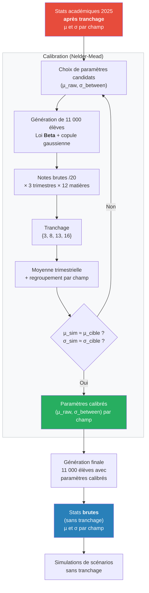
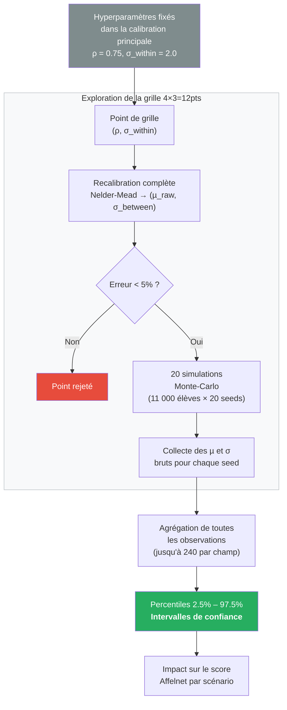

Suite à une modélisation statistique, on prend comme hypothèse les moyennes et écarts-types académiques suivants pour simuler Affelnet Paris 2026 :

|            | Maths  | Français | Histoire-Géo | Langues | Sciences | Arts   | EPS    |
| ---------- | ------ | -------- | ------------ | ------- | -------- | ------ | ------ |
| Moyenne    | 12,152 | 12,631   | 13,119       | 13,822  | 13,458   | 15,930 | 15,883 |
| Écart-type | 4,989  | 3,945    | 4,076        | 4,211   | 3,660    | 2,960  | 2,889  |

Cette page détaille la méthodologie utilisée pour produire ces chiffres.

## Méthode d'estimation des statistiques brutes (sans tranchage)

Les seules données publiques disponibles sont les statistiques académiques **après tranchage** (le système Affelnet convertit les notes en paliers {3, 8, 13, 16}). Or, pour simuler un scénario sans tranchage, il faut connaître les distributions brutes des notes.

Le problème est donc inverse : à partir des moyennes et écarts-types observés après tranchage, retrouver les distributions de notes brutes sous-jacentes.

### Vue d'ensemble du processus



### Modèle génératif

Pour chaque champ disciplinaire, on simule 11 000 élèves :

1. **Notes brutes** : les aptitudes de chaque élève suivent une loi **Beta** sur [0, 20]. Le choix d'une loi Beta plutôt qu'une simple gaussienne est important : les notes scolaires sont bornées entre 0 et 20, et leur distribution est souvent asymétrique (concentrée vers le haut pour des matières comme Arts ou EPS). Une loi normale tronquée à [0, 20] introduirait des artefacts aux bornes (accumulation artificielle d'élèves à 0 ou 20 par clipping), fausserait la moyenne et l'écart-type effectifs, et ne pourrait pas capturer l'asymétrie naturelle des distributions. La loi Beta, définie nativement sur un intervalle borné, respecte ces contraintes sans manipulation artificielle et peut prendre des formes très variées (symétrique, asymétrique à gauche ou à droite, uniforme) selon ses paramètres (a, b), déduits ici d'une moyenne `µ_raw` et d'un écart-type `σ_between` à calibrer.

2. **Corrélation intra-champ** : pour les champs composés de plusieurs matières (ex. Sciences = Physique-Chimie + SVT + Technologie), les aptitudes des matières d'un même champ sont corrélées via une **copule gaussienne** (ρ = 0.75). Une copule est un outil statistique qui permet de coupler des distributions marginales quelconques (ici des lois Beta) tout en contrôlant leur dépendance. La copule gaussienne fonctionne en trois étapes : on génère d'abord des variables normales corrélées (via un facteur commun partagé et un facteur individuel par matière), puis on les transforme en variables uniformes sur [0, 1] via la CDF normale, et enfin on les convertit en loi Beta via la CDF inverse. Ainsi, chaque matière suit bien une loi Beta marginale, mais un élève bon en SVT a de fortes chances d'être aussi bon en Physique-Chimie.

3. **Variabilité trimestrielle** : chaque élève a 3 notes par matière. Un bruit gaussien (σ = 2 points) est ajouté à l'aptitude stable pour simuler la variabilité d'un trimestre à l'autre.

4. **Pipeline Affelnet** : les notes brutes passent par le tranchage ({3, 8, 13, 16}), puis par la moyenne trimestrielle et le regroupement par champ, reproduisant le calcul officiel.

### Calibration par optimisation

Pour chaque champ, on cherche le couple (µ_raw, σ_between) tel que, après passage dans le pipeline complet (tranchage → moyenne → regroupement), les statistiques simulées correspondent aux statistiques académiques cibles.

L'optimisation utilise **Nelder-Mead** en plusieurs passes. Nelder-Mead est un algorithme d'optimisation sans gradient : il explore l'espace des paramètres en déformant un simplexe (un triangle en 2D) qui se contracte progressivement vers le minimum. Il est adapté ici car la fonction objectif est bruitée (basée sur des simulations Monte-Carlo) et non différentiable (le tranchage introduit des discontinuités), ce qui exclut les méthodes à gradient classiques. Voir https://fr.wikipedia.org/wiki/M%C3%A9thode_de_Nelder-Mead pour plus de précisions.

- **Passe 1** : exploration large sur une grille de points de départ, parallélisée sur plusieurs cœurs.
- **Passe 2** : raffinement séquentiel autour du meilleur point.
- **Passe 3** (champs sensibles Arts/EPS) : grille fine 2D supplémentaire, car le tranchage crée une sensibilité extrême autour du seuil 15 pour ces champs à moyennes élevées.

La fonction objectif compare, sur plusieurs seeds (5 en standard, 12 en haute précision), les moyennes et écarts-types simulés aux cibles, avec une pondération renforcée sur σ pour les champs à faible dispersion.

**Contrainte EPS** : le µ_raw d'EPS est contraint à être identique à celui d'Arts (matières notées de façon très comparable), seul σ_between est optimisé librement.

### Résultat

Une fois calibrés, les paramètres (µ_raw, σ_between) permettent de générer des distributions de notes brutes réalistes. Les statistiques de ces distributions **avant tranchage** donnent les moyennes et écarts-types du tableau ci-dessus, utilisés dans les simulations de scénarios sans tranchage.

```
========================================================================
  SIMULATION AFFELNET 2025 — 11 000 COLLÉGIENS PARISIENS
  (Parallélisation sur 6 cœurs)
========================================================================

▶ Phase 1 : Calibration des distributions de notes brutes...
  (ARTS calibré en premier, EPS hérite du même µ_raw)

  ARTS                    µ_raw= 16.09  σ_between= 3.27 [HP]
  FRANCAIS                µ_raw= 12.68  σ_between= 3.83
  HISTOIRE-GEO            µ_raw= 13.22  σ_between= 4.34
  LANGUES VIVANTES        µ_raw= 13.96  σ_between= 4.52
  MATHEMATIQUES           µ_raw= 12.25  σ_between= 4.97
  SCIENCES-TECHNO-DP      µ_raw= 13.54  σ_between= 4.01
  EPS (contraint)         µ_raw= 16.09  σ_between= 2.88  (µ_raw hérité de ARTS) [HP]

▶ Phase 2 : Génération des notes de 11 000 élèves...

▶ Phase 3 : Vérification des statistiques académiques

  Champ                   µ cible    µ sim   err%    σ cible    σ sim   err%
  ────────────────────────────────────────────────────────────────────
  ARTS                     14.555   14.538  0.12% ✓    1.961    1.977  0.81% ✓
  EPS                      14.640   14.656  0.11% ✓    1.897    1.901  0.21% ✓
  FRANCAIS                 12.360   12.362  0.01% ✓    3.224    3.221  0.11% ✓
  HISTOIRE-GEO             12.606   12.622  0.13% ✓    3.174    3.143  0.96% ✓
  LANGUES VIVANTES         13.031   13.063  0.24% ✓    3.174    3.136  1.20% ✓
  MATHEMATIQUES            11.779   11.804  0.21% ✓    4.046    4.061  0.35% ✓
  SCIENCES-TECHNO-DP       12.921   12.935  0.11% ✓    2.805    2.785  0.72% ✓

▶ Statistiques brutes (sans tranchage) par champ disciplinaire

  Champ                    µ brut   σ brut    µ tranché  σ tranché    µ cible  σ cible
  ──────────────────────────────────────────────────────────────────────────────────
  ARTS                     15.885    2.999       14.538      1.977     14.555    1.961
  EPS                      15.920    2.948       14.656      1.901     14.640    1.897
  FRANCAIS                 12.621    3.949       12.362      3.221     12.360    3.224
  HISTOIRE-GEO             13.118    4.025       12.622      3.143     12.606    3.174
  LANGUES VIVANTES         13.840    4.143       13.063      3.136     13.031    3.174
  MATHEMATIQUES            12.201    5.020       11.804      4.061     11.779    4.046
  SCIENCES-TECHNO-DP       13.462    3.620       12.935      2.785     12.921    2.805

▶ Étape 3 : Harmonisation académique
  Notes harmonisées : moyenne ≈ 100, écart-type ≈ 10 pour chaque champ ✓

▶ Étape 4 : Calcul du barème Affelnet

  Score moyen              :   3001.129
  Score médian             :   3009.848
  Score minimum            :   2388.801
  Score maximum            :   3286.071
  Écart-type               :    113.822
  Percentile 10%           :   2847.734
  Percentile 25%           :   2927.581
  Percentile 75%           :   3083.327
  Percentile 90%           :   3142.809

▶ Vérification : élève avec >15 partout à chaque trimestre

  ARTS                  : T=16  H= 107.37  ×4 =   429.47
  EPS                   : T=16  H= 107.17  ×4 =   428.66
  FRANCAIS              : T=16  H= 111.29  ×5 =   556.44
  HISTOIRE-GEO          : T=16  H= 110.69  ×4 =   442.78
  LANGUES VIVANTES      : T=16  H= 109.35  ×4 =   437.41
  MATHEMATIQUES         : T=16  H= 110.43  ×5 =   552.16
  SCIENCES-TECHNO-DP    : T=16  H= 110.98  ×4 =   443.90

  ══> Score total = 3290.824  (attendu ≈ 3291) ✓

▶ Aperçu des notes brutes simulées (sur 20)

  Matière                 Moy T1  Moy T2  Moy T3     Moy       σ   Min   Max
  ─────────────────────────────────────────────────────────────────
  Français                 12.63   12.60   12.64   12.62    3.95   0.0  20.0
  Mathématiques            12.19   12.23   12.18   12.20    5.02   0.0  20.0
  Histoire-Géo             13.08   13.13   13.11   13.11    4.38   0.0  20.0
  EMC                      13.13   13.15   13.11   13.13    4.36   0.0  20.0
  LV1                      13.85   13.84   13.85   13.85    4.51   0.0  20.0
  LV2                      13.84   13.82   13.84   13.83    4.51   0.0  20.0
  EPS                      15.92   15.91   15.93   15.92    2.95   0.0  20.0
  Arts Plastiques          15.90   15.89   15.90   15.90    3.28   0.0  20.0
  Éducation Musicale       15.85   15.87   15.89   15.87    3.30   0.0  20.0
  SVT                      13.46   13.46   13.46   13.46    4.09   0.0  20.0
  Technologie              13.47   13.45   13.45   13.46    4.06   0.0  20.0
  Physique-Chimie          13.48   13.45   13.49   13.47    4.08   0.0  20.0

========================================================================
  ÉTUDE D'IMPACT : SUPPRESSION DU TRANCHAGE
  Score scolaire × coefficient (2.0 à 2.5)
========================================================================

  Score scolaire de base (sans coef):
    Élève à 19/20 partout : 3401.3
    Élève à 10/20 partout : 2679.8

    Coef   Score 19   Score 10    Écart
  ──────────────────────────────────────
     2.0       6803       5360     1443
     2.1       7143       5627     1516
     2.2       7483       5895     1588
     2.3       7823       6163     1660
     2.4       8163       6431     1732
     2.5       8503       6699     1804

  Repères ancien système (avec tranchage, coef 2.5):
    Plafond (T=16) : 8227
    Moyen   (T=13) : 7411

  → Graphique sauvegardé : calibration_sans_tranchage_2025.png

▶ Exemples de profils d'élèves

  ═══ Meilleur élève (score: 3286.071) ═══
    Français                 19.2   19.4   15.2  → tranché: 16 16 16 (moy=16.00)
    Mathématiques            18.3   18.6   19.2  → tranché: 16 16 16 (moy=16.00)
    Histoire-Géo             20.0   18.9   16.2  → tranché: 16 16 16 (moy=16.00)
    EMC                      19.4   18.3   20.0  → tranché: 16 16 16 (moy=16.00)
    LV1                      19.2   17.4   18.3  → tranché: 16 16 16 (moy=16.00)
    LV2                      20.0   17.2   20.0  → tranché: 16 16 16 (moy=16.00)
    EPS                      19.5   19.9   18.3  → tranché: 16 16 16 (moy=16.00)
    Arts Plastiques          17.4   18.6   19.1  → tranché: 16 16 16 (moy=16.00)
    Éducation Musicale       20.0   16.2   20.0  → tranché: 16 16 16 (moy=16.00)
    SVT                      18.7   16.8   15.0  → tranché: 16 16 16 (moy=16.00)
    Technologie              15.3   16.2   15.0  → tranché: 16 16 13 (moy=15.00)
    Physique-Chimie          18.2   20.0   20.0  → tranché: 16 16 16 (moy=16.00)

  ═══ Élève médian (score: 3009.850) ═══
    Français                 12.9   11.9   16.3  → tranché: 13 13 16 (moy=14.00)
    Mathématiques            14.6   20.0   16.9  → tranché: 13 16 16 (moy=15.00)
    Histoire-Géo             12.2   11.2   12.3  → tranché: 13 13 13 (moy=13.00)
    EMC                       7.5    8.5   10.4  → tranché:  8  8 13 (moy=9.67)
    LV1                       2.8    3.4    4.5  → tranché:  3  3  3 (moy=3.00)
    LV2                       2.8    0.0    2.0  → tranché:  3  3  3 (moy=3.00)
    EPS                      16.3   17.7   20.0  → tranché: 16 16 16 (moy=16.00)
    Arts Plastiques          14.2   15.7   15.8  → tranché: 13 16 16 (moy=15.00)
    Éducation Musicale       18.3   16.6   19.3  → tranché: 16 16 16 (moy=16.00)
    SVT                      13.7   20.0   18.0  → tranché: 13 16 16 (moy=15.00)
    Technologie              20.0   18.6   16.8  → tranché: 16 16 16 (moy=16.00)
    Physique-Chimie          16.7   18.5   19.1  → tranché: 16 16 16 (moy=16.00)

  ═══ Élève le plus bas (score: 2388.801) ═══
    Français                  8.5    4.8    6.0  → tranché:  8  3  8 (moy=6.33)
    Mathématiques             2.6    1.2    2.5  → tranché:  3  3  3 (moy=3.00)
    Histoire-Géo             13.3   11.1   16.1  → tranché: 13 13 16 (moy=14.00)
    EMC                      17.2   13.8   12.4  → tranché: 16 13 13 (moy=14.00)
    LV1                       7.4    9.8    7.9  → tranché:  8  8  8 (moy=8.00)
    LV2                       6.4    5.2    3.0  → tranché:  8  8  3 (moy=6.33)
    EPS                       5.0    4.5    8.3  → tranché:  3  3  8 (moy=4.67)
    Arts Plastiques          10.8   11.9    9.9  → tranché: 13 13  8 (moy=11.33)
    Éducation Musicale       14.6   14.1   13.0  → tranché: 13 13 13 (moy=13.00)
    SVT                       3.2    0.0    0.2  → tranché:  3  3  3 (moy=3.00)
    Technologie               7.4    9.6    6.3  → tranché:  8  8  8 (moy=8.00)
    Physique-Chimie           7.8    6.4    5.1  → tranché:  8  8  8 (moy=8.00)

========================================================================
  ✅ Simulation terminée avec succès
========================================================================

```

### Estimation des intervalles de confiance

La calibration principale fixe deux hyperparamètres structurels de façon arbitraire : la corrélation intra-champ (ρ = 0.75) et le bruit trimestriel (σ_within = 2.0). Pour mesurer la sensibilité des résultats à ces choix, le programme `model/modelisation_confiance.py` estime des intervalles de confiance en explorant une grille de valeurs alternatives.



**Principe** : on fait varier ρ ∈ {0.60, 0.70, 0.80, 0.90} et σ_within ∈ {1.5, 2.0, 2.5}, soit 12 combinaisons. Pour chaque point de cette grille :

1. **Recalibration complète** : on relance l'optimisation Nelder-Mead pour trouver les (µ_raw, σ_between) qui font coller les statistiques tranchées aux cibles académiques 2025. Les points qui ne convergent pas (erreur relative > 5%) sont rejetés.

2. **Simulation Monte-Carlo** : pour chaque calibration réussie, on génère 20 jeux de 11 000 élèves avec des seeds différentes, et on collecte les moyennes et écarts-types bruts (sans tranchage) résultants.

Les intervalles à 95% sont les percentiles 2.5%–97.5% sur l'ensemble des observations (12 points de grille × 20 seeds = jusqu'à 240 valeurs par champ). Ils intègrent deux sources d'incertitude :

- **Incertitude de modélisation** : sensibilité aux hypothèses structurelles (ρ, σ_within)
- **Variabilité Monte-Carlo** : fluctuations dues à l'échantillonnage fini (11 000 élèves)

Voici les résultats :

```
========================================================================
  ESTIMATION DES INTERVALLES DE CONFIANCE
  Modèle : Beta + copule gaussienne (cohérent simulation finale)
  Grille : 4 ρ × 3 σ_within = 12 points × 20 seeds
  Parallélisation sur 6 cœurs physiques
  Haute précision pour : ARTS, EPS
========================================================================
  [PID 52640] ρ=0.70 σw=2.5 | ARTS                 ✓ err=0.002 [288.8s] [HP]
  [PID 52636] ρ=0.60 σw=2.5 | ARTS                 ✓ err=0.005 [290.6s] [HP]
  [PID 52639] ρ=0.70 σw=2.0 | ARTS                 ✓ err=0.003 [304.7s] [HP]
  [PID 52637] ρ=0.60 σw=2.0 | ARTS                 ✓ err=0.006 [306.8s] [HP]
  [PID 52635] ρ=0.70 σw=1.5 | ARTS                 ✓ err=0.003 [309.3s] [HP]
  [PID 52638] ρ=0.60 σw=1.5 | ARTS                 ✓ err=0.002 [313.7s] [HP]
  [PID 52640] ρ=0.70 σw=2.5 | EPS                  ✓ err=0.011 [162.3s] [HP]
  [PID 52639] ρ=0.70 σw=2.0 | EPS                  ✓ err=0.009 [154.9s] [HP]
  [PID 52636] ρ=0.60 σw=2.5 | EPS                  ✓ err=0.006 [171.3s] [HP]
  [PID 52637] ρ=0.60 σw=2.0 | EPS                  ✓ err=0.011 [168.5s] [HP]
  [PID 52640] ρ=0.70 σw=2.5 | FRANCAIS             ✓ err=0.008 [27.7s]
  [PID 52638] ρ=0.60 σw=1.5 | EPS                  ✓ err=0.011 [168.7s] [HP]
  [PID 52635] ρ=0.70 σw=1.5 | EPS                  ✓ err=0.011 [174.3s] [HP]
  [PID 52639] ρ=0.70 σw=2.0 | FRANCAIS             ✓ err=0.005 [27.3s]
  [PID 52636] ρ=0.60 σw=2.5 | FRANCAIS             ✓ err=0.007 [25.6s]
  [PID 52637] ρ=0.60 σw=2.0 | FRANCAIS             ✓ err=0.005 [25.4s]
  [PID 52638] ρ=0.60 σw=1.5 | FRANCAIS             ✓ err=0.007 [25.7s]
  [PID 52635] ρ=0.70 σw=1.5 | FRANCAIS             ✓ err=0.004 [26.1s]
  [PID 52640] ρ=0.70 σw=2.5 | HISTOIRE-GEO         ✓ err=0.008 [35.3s]
  [PID 52639] ρ=0.70 σw=2.0 | HISTOIRE-GEO         ✓ err=0.009 [35.8s]
  [PID 52636] ρ=0.60 σw=2.5 | HISTOIRE-GEO         ✓ err=0.009 [37.2s]
  [PID 52637] ρ=0.60 σw=2.0 | HISTOIRE-GEO         ✓ err=0.010 [34.3s]
  [PID 52638] ρ=0.60 σw=1.5 | HISTOIRE-GEO         ✓ err=0.010 [35.9s]
  [PID 52635] ρ=0.70 σw=1.5 | HISTOIRE-GEO         ✓ err=0.009 [39.3s]
  [PID 52640] ρ=0.70 σw=2.5 | LANGUES VIVANTES     ✓ err=0.007 [38.5s]
  [PID 52639] ρ=0.70 σw=2.0 | LANGUES VIVANTES     ✓ err=0.010 [37.4s]
  [PID 52636] ρ=0.60 σw=2.5 | LANGUES VIVANTES     ✓ err=0.011 [37.7s]
  [PID 52640] ρ=0.70 σw=2.5 | MATHEMATIQUES        ✓ err=0.005 [18.8s]
  [PID 52637] ρ=0.60 σw=2.0 | LANGUES VIVANTES     ✓ err=0.010 [38.9s]
  [PID 52639] ρ=0.70 σw=2.0 | MATHEMATIQUES        ✓ err=0.009 [18.1s]
  [PID 52636] ρ=0.60 σw=2.5 | MATHEMATIQUES        ✓ err=0.012 [17.6s]
  [PID 52638] ρ=0.60 σw=1.5 | LANGUES VIVANTES     ✓ err=0.012 [39.5s]
  [PID 52635] ρ=0.70 σw=1.5 | LANGUES VIVANTES     ✓ err=0.008 [37.3s]
  [PID 52637] ρ=0.60 σw=2.0 | MATHEMATIQUES        ✓ err=0.010 [18.2s]
  [PID 52638] ρ=0.60 σw=1.5 | MATHEMATIQUES        ✓ err=0.011 [19.2s]
  [PID 52635] ρ=0.70 σw=1.5 | MATHEMATIQUES        ✓ err=0.009 [19.3s]
  [PID 52640] ρ=0.70 σw=2.5 | SCIENCES-TECHNO-DP   ✓ err=0.004 [56.4s]
  [PID 52640] ρ=0.70 σw=2.5 | ══ TERMINÉ (20 seeds) [634s total] ══
  [PID 52636] ρ=0.60 σw=2.5 | SCIENCES-TECHNO-DP   ✓ err=0.005 [55.6s]
  [PID 52639] ρ=0.70 σw=2.0 | SCIENCES-TECHNO-DP   ✓ err=0.006 [64.0s]
  [PID 52636] ρ=0.60 σw=2.5 | ══ TERMINÉ (20 seeds) [642s total] ══
  [PID 52637] ρ=0.60 σw=2.0 | SCIENCES-TECHNO-DP   ✓ err=0.004 [55.4s]
  [PID 52639] ρ=0.70 σw=2.0 | ══ TERMINÉ (20 seeds) [649s total] ══
  [PID 52637] ρ=0.60 σw=2.0 | ══ TERMINÉ (20 seeds) [654s total] ══
  [PID 52638] ρ=0.60 σw=1.5 | SCIENCES-TECHNO-DP   ✓ err=0.008 [58.4s]
  [PID 52638] ρ=0.60 σw=1.5 | ══ TERMINÉ (20 seeds) [668s total] ══
  [ 25.0%] 3/12 points  (669s écoulé, ~2008s restant)     [PID 52635] ρ=0.70 σw=1.5 | SCIENCES-TECHNO-DP   ✓ err=0.003 [66.9s]
  [PID 52635] ρ=0.70 σw=1.5 | ══ TERMINÉ (20 seeds) [680s total] ══
  [ 50.0%] 6/12 points  (682s écoulé, ~682s restant)     [PID 52639] ρ=0.80 σw=2.5 | ARTS                 ✓ err=0.003 [275.2s] [HP]
  [PID 52640] ρ=0.80 σw=1.5 | ARTS                 ✓ err=0.004 [301.0s] [HP]
  [PID 52636] ρ=0.80 σw=2.0 | ARTS                 ✓ err=0.005 [295.1s] [HP]
  [PID 52637] ρ=0.90 σw=1.5 | ARTS                 ✓ err=0.004 [296.5s] [HP]
  [PID 52638] ρ=0.90 σw=2.0 | ARTS                 ✓ err=0.006 [314.4s] [HP]
  [PID 52635] ρ=0.90 σw=2.5 | ARTS                 ✓ err=0.005 [304.4s] [HP]
  [PID 52639] ρ=0.80 σw=2.5 | EPS                  ✓ err=0.011 [164.1s] [HP]
  [PID 52640] ρ=0.80 σw=1.5 | EPS                  ✓ err=0.014 [171.1s] [HP]
  [PID 52639] ρ=0.80 σw=2.5 | FRANCAIS             ✓ err=0.002 [26.2s]
  [PID 52636] ρ=0.80 σw=2.0 | EPS                  ✓ err=0.015 [182.1s] [HP]
  [PID 52637] ρ=0.90 σw=1.5 | EPS                  ✓ err=0.013 [172.9s] [HP]
  [PID 52640] ρ=0.80 σw=1.5 | FRANCAIS             ✓ err=0.002 [26.4s]
  [PID 52636] ρ=0.80 σw=2.0 | FRANCAIS             ✓ err=0.001 [27.2s]
  [PID 52637] ρ=0.90 σw=1.5 | FRANCAIS             ✓ err=0.002 [25.7s]
  [PID 52638] ρ=0.90 σw=2.0 | EPS                  ✓ err=0.010 [170.8s] [HP]
  [PID 52635] ρ=0.90 σw=2.5 | EPS                  ✓ err=0.013 [169.0s] [HP]
  [PID 52639] ρ=0.80 σw=2.5 | HISTOIRE-GEO         ✓ err=0.007 [42.3s]
  [PID 52638] ρ=0.90 σw=2.0 | FRANCAIS             ✓ err=0.001 [26.1s]
  [PID 52640] ρ=0.80 σw=1.5 | HISTOIRE-GEO         ✓ err=0.013 [47.3s]
  [PID 52635] ρ=0.90 σw=2.5 | FRANCAIS             ✓ err=0.002 [26.9s]
  [PID 52636] ρ=0.80 σw=2.0 | HISTOIRE-GEO         ✓ err=0.009 [44.0s]
  [PID 52637] ρ=0.90 σw=1.5 | HISTOIRE-GEO         ✓ err=0.009 [50.7s]
  [PID 52639] ρ=0.80 σw=2.5 | LANGUES VIVANTES     ✓ err=0.008 [43.3s]
  [PID 52640] ρ=0.80 σw=1.5 | LANGUES VIVANTES     ✓ err=0.010 [38.6s]
  [PID 52639] ρ=0.80 σw=2.5 | MATHEMATIQUES        ✓ err=0.005 [19.3s]
  [PID 52635] ρ=0.90 σw=2.5 | HISTOIRE-GEO         ✓ err=0.006 [44.8s]
  [PID 52638] ρ=0.90 σw=2.0 | HISTOIRE-GEO         ✓ err=0.010 [47.1s]
  [PID 52636] ρ=0.80 σw=2.0 | LANGUES VIVANTES     ✓ err=0.010 [40.5s]
  [PID 52640] ρ=0.80 σw=1.5 | MATHEMATIQUES        ✓ err=0.007 [20.1s]
  [PID 52637] ρ=0.90 σw=1.5 | LANGUES VIVANTES     ✓ err=0.011 [41.3s]
  [PID 52636] ρ=0.80 σw=2.0 | MATHEMATIQUES        ✓ err=0.007 [19.6s]
  [PID 52637] ρ=0.90 σw=1.5 | MATHEMATIQUES        ✓ err=0.003 [21.4s]
  [PID 52635] ρ=0.90 σw=2.5 | LANGUES VIVANTES     ✓ err=0.007 [40.4s]
  [PID 52638] ρ=0.90 σw=2.0 | LANGUES VIVANTES     ✓ err=0.012 [39.9s]
  [PID 52635] ρ=0.90 σw=2.5 | MATHEMATIQUES        ✓ err=0.003 [18.4s]
  [PID 52638] ρ=0.90 σw=2.0 | MATHEMATIQUES        ✓ err=0.003 [19.9s]
  [PID 52639] ρ=0.80 σw=2.5 | SCIENCES-TECHNO-DP   ✓ err=0.003 [68.1s]
  [PID 52639] ρ=0.80 σw=2.5 | ══ TERMINÉ (20 seeds) [646s total] ══
  [PID 52640] ρ=0.80 σw=1.5 | SCIENCES-TECHNO-DP   ✓ err=0.003 [74.2s]
  [PID 52636] ρ=0.80 σw=2.0 | SCIENCES-TECHNO-DP   ✓ err=0.004 [66.8s]
  [PID 52640] ρ=0.80 σw=1.5 | ══ TERMINÉ (20 seeds) [686s total] ══
  [ 58.3%] 7/12 points  (1322s écoulé, ~944s restant)     [PID 52636] ρ=0.80 σw=2.0 | ══ TERMINÉ (20 seeds) [682s total] ══
  [ 75.0%] 9/12 points  (1326s écoulé, ~442s restant)     [PID 52637] ρ=0.90 σw=1.5 | SCIENCES-TECHNO-DP   ✓ err=0.002 [67.5s]
  [PID 52637] ρ=0.90 σw=1.5 | ══ TERMINÉ (20 seeds) [682s total] ══
  [ 83.3%] 10/12 points  (1337s écoulé, ~267s restant)     [PID 52638] ρ=0.90 σw=2.0 | SCIENCES-TECHNO-DP   ✓ err=0.003 [56.9s]
  [PID 52635] ρ=0.90 σw=2.5 | SCIENCES-TECHNO-DP   ✓ err=0.004 [61.9s]
  [PID 52638] ρ=0.90 σw=2.0 | ══ TERMINÉ (20 seeds) [680s total] ══
  [ 91.7%] 11/12 points  (1349s écoulé, ~123s restant)     [PID 52635] ρ=0.90 σw=2.5 | ══ TERMINÉ (20 seeds) [671s total] ══
  [100.0%] 12/12 points  (1352s écoulé, ~0s restant)

  Terminé en 1353s — 0/12 points de grille rejetés (err > 5%)

========================================================================
  RÉSULTATS : INTERVALLES DE CONFIANCE À 95%
========================================================================

  Champ                  │   µ_min  µ_central    µ_max │   σ_min  σ_central    σ_max │ N_obs
  ─────────────────────────────────────────────────────────────────────────────────────
  ARTS                   │  15.671     15.926   16.160 │   2.904      2.960    3.007 │ 240
  EPS                    │  15.708     15.873   16.062 │   2.824      2.891    2.961 │ 240
  FRANCAIS               │  12.504     12.642   12.777 │   3.851      3.946    4.048 │ 240
  HISTOIRE-GEO           │  12.922     13.124   13.341 │   3.965      4.071    4.175 │ 240
  LANGUES VIVANTES       │  13.572     13.821   14.016 │   4.102      4.208    4.308 │ 240
  MATHEMATIQUES          │  12.041     12.161   12.299 │   4.866      4.983    5.123 │ 240
  SCIENCES-TECHNO-DP     │  13.238     13.458   13.702 │   3.557      3.662    3.766 │ 240

  ┌────────────────────────────────────────────────────────────────────┐
  │  INTERPRÉTATION                                                    │
  │                                                                    │
  │  Les intervalles ci-dessus sont des percentiles 2.5%–97.5% sur     │
  │  l'ensemble des observations (grille × seeds).                     │
  │                                                                    │
  │  Ils intègrent DEUX sources d'incertitude :                        │
  │   • Variabilité Monte Carlo (N=11000, 20 seeds/point)              │
  │   • Incertitude de modélisation (ρ ∈ [0.6,0.9],                    │
  │     σ_within ∈ [1.5,2.5])                                          │
  │                                                                    │
  │  Modèle : Beta + copule gaussienne (bornée [0,20], pas de          │
  │  clipping artificiel). Calibration haute précision pour ARTS/EPS.  │
  │                                                                    │
  └────────────────────────────────────────────────────────────────────┘

  Largeur des intervalles :
  Champ                  │      Δµ       Δσ
  ────────────────────────────────────────
  ARTS                   │   0.490    0.103
  EPS                    │   0.354    0.137
  FRANCAIS               │   0.273    0.197
  HISTOIRE-GEO           │   0.419    0.211
  LANGUES VIVANTES       │   0.444    0.206
  MATHEMATIQUES          │   0.257    0.257
  SCIENCES-TECHNO-DP     │   0.464    0.209

  Impact sur le score Affelnet (élève à 19/20 partout, coef 2.5) :
  Scénario               │    Score
  ───────────────────────────────────
  Intervalle bas         │     8489
  Central                │     8504
  Intervalle haut        │     8517

========================================================================
  ✅ Analyse terminée
========================================================================
```
